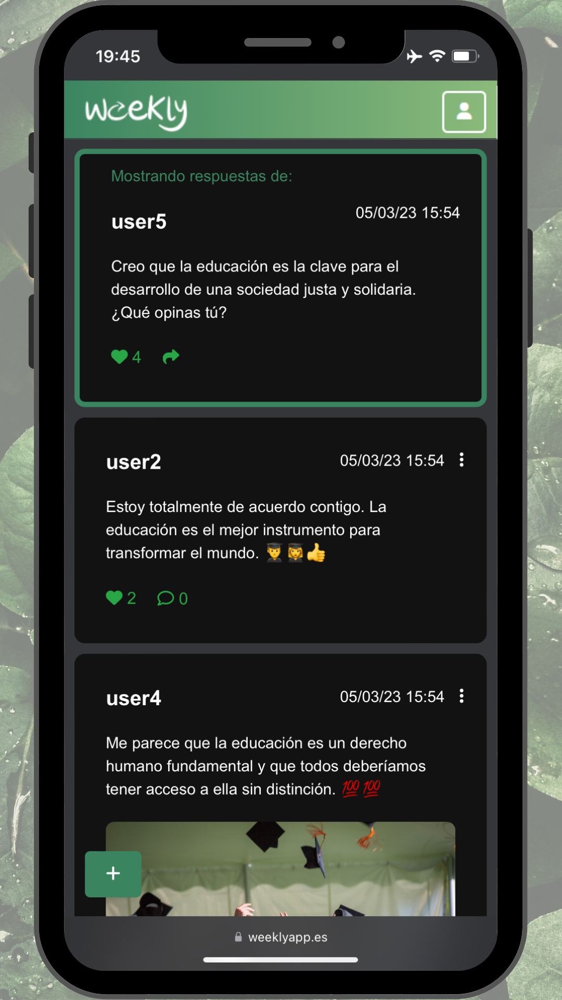

  

# weekly

En Weekly, todos los mensajes se borran cada semana. Esto significa que siempre verás contenido fresco y relevante. Además, también ayuda a reducir la cantidad de información obsoleta en la plataforma, fomentando la creación de contenido nuevo y evitando que la plataforma se llene de publicaciones antiguas.

Puedes configurar el contenido que quieres ver fácilmente desde los ajustes. Selecciona o quita tus gustos en cualquier momento y sólo verás el contenido que realmente te interesa, ahorrando tiempo y permitiéndote centrarte en lo que te importa.

Además, Weekly es una red social totalmente gratuita y sin publicidad. No tendrás que preocuparte por anuncios molestos o intrusivos mientras usas la plataforma. Otro gran punto fuerte de Weekly es que no hay concepto de seguidores. No tienes que preocuparte por conseguir seguidores para que tus publicaciones sean vistas por otros, tus publicaciones se ordenarán automáticamente según el interés del resto de usuarios.

  

### Capturas de pantalla:
En smartphone:

  
  
  

### Uso:
La web está alojada en un servidor, por lo que se puede acceder a ella desde cualquier navegador web.

Si se desea usar en local, se puede descargar el repositorio y ejecutarlo en un servidor local. Para ello, se puede utilizar XAMPP, que es un paquete de software libre, que consiste principalmente en el sistema de gestión de bases de datos MySQL, el servidor web Apache y los intérpretes para lenguajes de script: PHP y Perl. Se explica en el siguiente apartado.

### Instalación en local:
- Descargar e instalar XAMPP desde su [página web](https://www.apachefriends.org/es/index.html).
- Descargar el repositorio y descomprimir. Introducir la carpeta `weekly` en la carpeta `htdocs` de XAMPP.
- Abrir XAMPP y arrancar los servicios de Apache y MySQL.
- Abrir el navegador web y acceder a `localhost/phpmyadmin`. Se abrirá la interfaz de administración de MySQL.
- Crear una base de datos llamada `weekly` e importar el archivo `.sql` que se encuentra en la carpeta raiz del proyecto. (Copiar solo la parte de creación de tablas y datos, no la de creación de la base de datos)
- Abrir el navegador web y acceder a `127.0.0.1/weekly`. Se abrirá la página de inicio de Weekly.
- Si obtenemos la dirección IP de nuestro ordenador, podremos acceder a la web desde cualquier dispositivo conectado a la misma red local.

### Tecnologías utilizadas:
- **PHP** → Utilizado principalmente para conectar la base de datos con la web y para
algunas funcionalidades.
- **HTML** → Lenguaje de marcado utilizado para crear y estructurar contenido web.
- **CSS**: Utilizado para diseñar y estilizar la presentación visual de la web.
- **JavaScript** → Utilizado para crear funciones y efectos visuales de la web.
- **Ajax** → Tecnología que permite actualizar contenido en la web sin necesidad de recargar la página completa.
- **MySQL** → Utilizado para la base de datos.

### Requisitos de información:
En este punto se definirá la información mínima necesaria.

- **Datos de usuario**: en el apartado de registro, el usuario deberá aportar la siguiente información para crear su cuenta.
- **Email**: Se utilizará como medio principal de comunicación entre la plataforma y los usuarios. Tanto para información sobre actualización de términos y políticas, newsletter o recuperar contraseñas. (Debe ser único)
- **Usuario**: Se utilizará a la hora de iniciar sesión y como nombre identificativo a la hora de publicar contenido. (Debe ser único)
- Contraseña: Se utilizará para comprobar el inicio de sesión solamente.
- **Gustos del usuario**: Solamente se almacenará las categorías de las cuales el usuario quiere visualizar contenido en la pantalla de inicio.

No se necesitan más datos para el uso de la aplicación ya que el enfoque que Weekly tiene es respetar al máximo la privacidad de los usuarios.

### Modelo conceptual. Diagrama entidad-relación:
A continuación se muestra el diagrama entidad-relación de la base de datos de Weekly. En él se puede observar la estructura de la base de datos y las relaciones entre las tablas.

  

### Modelo lógico. Diagrama relacional:
A continuación se muestra el diagrama relacional de la base de datos de Weekly.

  

### Flujo de navegación:
A continuación se muestra el flujo de navegación de Weekly. En él se puede observar el flujo de pantallas que se siguen para realizar las acciones principales de la aplicación.

  

### Contacto:
Para cualquier duda o sugerencia, no dudes en contactar conmigo.

  
  

